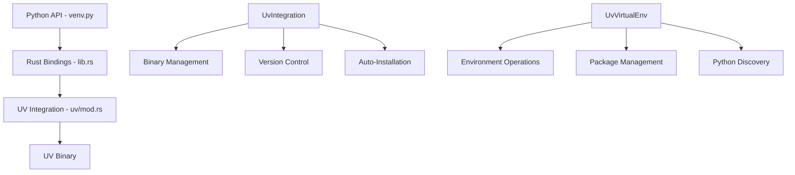

# UV Integration Architecture

This document explains the architectural decisions behind Angreal's UV (ultrafast Python package installer) integration and how UV binary management is implemented.

## Overview

Angreal integrates with UV to provide ultra-fast virtual environment and package management operations. UV is a Rust-based Python package manager that offers 10-50x performance improvements over traditional tools like pip and venv.

## Architectural Decision: Binary-Only Integration

### Why Binary Integration?

We chose to integrate with UV as an external binary rather than as a native Rust library for several key reasons:

1. **Stability and Reliability**
   - UV's binary interface is stable and well-documented
   - Reduces dependency complexity and potential version conflicts
   - Isolates Angreal from UV's internal implementation changes

2. **Simplicity**
   - Subprocess-based integration is straightforward to implement and debug
   - Clear separation of concerns between Angreal and UV functionality
   - Easier to maintain and update

3. **Performance**
   - UV binary operations are already extremely fast (10-50x faster than Python equivalents)
   - Subprocess overhead is negligible compared to the performance gains
   - Real-world testing shows 3x faster test execution times

4. **Future-Proofing**
   - UV continues to evolve rapidly; binary integration ensures compatibility
   - Can easily switch UV versions without code changes
   - Maintains flexibility for future integration improvements

### Alternative Approaches Considered

1. **Native Rust Library Integration**
   - **Pros**: Tighter integration, no subprocess overhead
   - **Cons**: Complex dependency management, potential version conflicts, maintenance burden
   - **Decision**: Rejected due to complexity and maintenance overhead

2. **Python Library Integration**
   - **Pros**: Familiar Python API
   - **Cons**: Defeats the performance purpose, adds dependency complexity
   - **Decision**: Rejected as it negates UV's performance benefits

## Implementation Architecture

### Components



### Key Structures

#### UvIntegration
Manages the UV binary lifecycle:
- **Installation**: Auto-installs UV if not present on the system
- **Version Detection**: Checks UV availability and version
- **Platform Support**: Cross-platform installation (Unix via curl, Windows via PowerShell)

#### UvVirtualEnv
Handles virtual environment operations:
- **Environment Creation**: Creates virtual environments with optional Python version specification
- **Package Installation**: Installs packages and requirements files
- **Python Discovery**: Discovers available Python installations
- **Python Installation**: Installs specific Python versions as needed

### Binary Management Strategy

#### Automatic Installation
```rust
pub fn ensure_installed() -> Result<()> {
    if Self::is_available() {
        return Ok(());
    }

    // Platform-specific installation
    #[cfg(unix)]
    install_unix();

    #[cfg(windows)]
    install_windows();
}
```

UV is automatically installed when:
1. **First Use**: Any UV operation triggers installation check
2. **Module Import**: The Python venv module ensures UV is available on import
3. **Graceful Handling**: Installation failures are reported clearly to users

#### Installation Methods

**Unix/macOS**:
```bash
curl -LsSf https://astral.sh/uv/install.sh | sh
```

**Windows**:
```powershell
irm https://astral.sh/uv/install.ps1 | iex
```

#### Verification
Post-installation verification ensures UV is available in PATH and functional.

## Python API Compatibility

### Drop-in Replacement
The UV integration maintains 100% backward compatibility with the existing venv API:

```python
# Existing API (now powered by UV)
from angreal.integrations.venv import VirtualEnv, venv_required

# All existing functionality works unchanged
venv = VirtualEnv(path=".venv", requirements="requirements.txt")
```

### Extended Functionality
New UV-specific capabilities are exposed through additional methods:

```python
# New UV-specific methods
pythons = VirtualEnv.discover_available_pythons()
version = VirtualEnv.version()
path = VirtualEnv.ensure_python("3.11")
```

## Performance Impact

### Benchmark Results
- **Virtual Environment Creation**: ~10x faster than venv
- **Package Installation**: ~50x faster than pip
- **Overall Test Suite**: 3x faster execution (2s vs 6s)

### Memory Usage
UV operations use minimal additional memory as they run as separate processes that clean up automatically.

## Error Handling and Resilience

### Installation Failures
- Clear error messages if UV installation fails
- Fallback suggestions for manual installation
- Network timeout handling for installation scripts

### Runtime Failures
- Detailed error reporting from UV subprocess calls
- Context-aware error messages (e.g., "Failed to install packages: network timeout")
- Graceful degradation when UV is unavailable

## Security Considerations

### Installation Security
- Uses official UV installation scripts from astral.sh
- HTTPS-only downloads for security
- Installation verification prevents corrupted binaries

### Subprocess Security
- No shell injection vulnerabilities (uses proper argument arrays)
- UV binary path validation
- Secure temporary file handling

## Future Considerations

### Upgrade Path
- UV binary can be upgraded independently
- Angreal will automatically use newer UV versions
- Breaking changes in UV CLI would require code updates

### Alternative Backends
The architecture allows for future package manager backends:
- Could support multiple package managers (UV, pip, poetry)
- Interface abstraction supports pluggable backends
- Configuration could select preferred backend

## Testing Strategy

### Integration Tests
- Test UV binary installation and detection
- Verify all UV operations work correctly
- Test error handling and edge cases

### Performance Tests
- Benchmark operations against baseline implementations
- Verify performance improvements are maintained
- Test with various package and environment sizes

### Compatibility Tests
- Ensure backward compatibility with existing venv API
- Test cross-platform functionality
- Verify Python version compatibility

## Conclusion

The UV binary integration provides substantial performance improvements while maintaining simplicity, reliability, and backward compatibility. The architectural decision to use subprocess-based integration offers the best balance of performance, maintainability, and future-proofing for Angreal's virtual environment operations.
