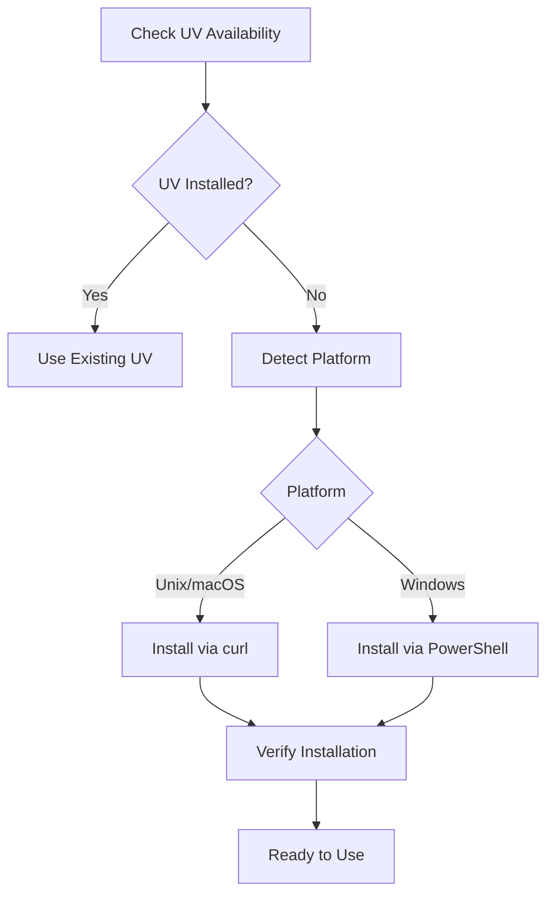

# UV Integration Architecture


This document explains how Angreal integrates with UV and why we chose a binary-first approach.

## Overview

Angreal uses UV (a fast Python package installer) as an external binary rather than a library. This approach provides several benefits:

1. **Stability**: UV's binary interface is stable and well-documented
2. **Simplicity**: Subprocess-based integration is straightforward to implement
3. **Performance**: UV operations are already extremely fast (10-50x faster than Python equivalents)
4. **Future-Proofing**: Can easily switch UV versions without code changes

## Auto-Installation Strategy

UV is automatically installed when:
1. **First Use**: Any UV operation triggers installation check
2. **Module Import**: The Python venv module ensures UV is available on import

### Installation Process



### Platform-Specific Installation


**Unix/macOS**:
```bash
curl -LsSf https://astral.sh/uv/install.sh | sh
```

**Windows**:
```powershell
irm https://astral.sh/uv/install.ps1 | iex
```


### Error Handling

If auto-installation fails:
1. Clear error messages are shown to the user
2. Manual installation instructions are provided
3. Network timeouts are handled gracefully

## Why Binary-First?

### Alternative Approaches Considered

1. **Native Rust Library Integration**
   - **Pros**: Tighter integration, no subprocess overhead
   - **Cons**: Complex dependency management, potential version conflicts
   - **Decision**: Rejected due to complexity and maintenance overhead

2. **Python Library Integration**
   - **Pros**: Familiar Python API
   - **Cons**: Defeats the performance purpose, adds dependency complexity
   - **Decision**: Rejected as it negates UV's performance benefits

### Benefits of Binary Integration

1. **Isolation**: UV's internal implementation changes don't affect Angreal
2. **Maintenance**: Easier to update UV independently
3. **Reliability**: Clear separation of concerns between Angreal and UV
4. **Performance**: Subprocess overhead is negligible compared to UV's speed

## Security Considerations

- Uses official UV installation scripts from astral.sh
- HTTPS-only downloads for security
- Installation verification prevents corrupted binaries
- No shell injection vulnerabilities (uses proper argument arrays)

## Future Considerations

The binary-first approach allows for:
- Easy UV version updates
- Potential support for multiple package managers
- Simple integration of future UV features
