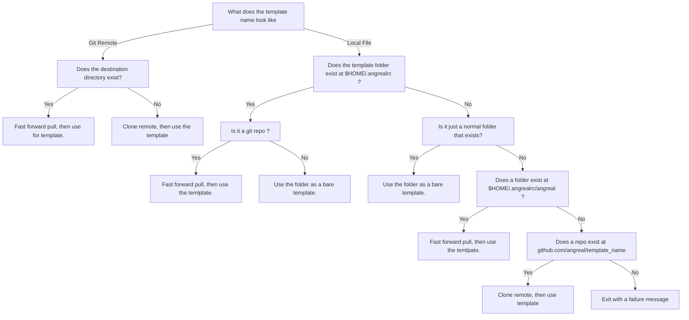

When you call `angreal init <template>` we use the following decision tree to
determining where we look for templates for download.

This should allow for :
- people to re-use templates after clone more easily by using something like, `angreal init https://github.com/user/template` and later with `angreal init user/template`.

- angreal to provide supported templates at https://github.com/angreal/template name that are accessible through both `angreal init angreal/template` or `angreal init template`

- local development of temlpates via `angreal init path/to/template` where the template can exist in `${HOME}/.angrealrc/path/to/template` or just `path/to/template`

Functionally this means if you run `angreal init python` at least once the following commands would be synonymous :
- `angreal init python`
- `angreal init angreal/python`
- `angreal init ${HOME}/.angrealrc/python`

