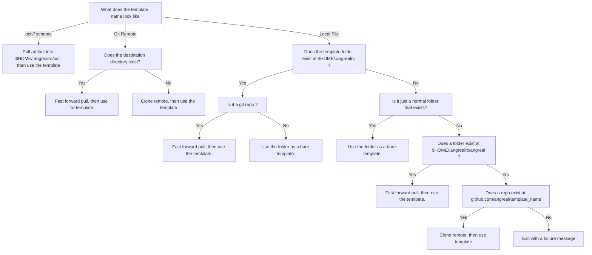

When you call `angreal init <template>` we use the following decision tree to
determining where we look for templates for download.

This should allow for :
- people to re-use templates after clone more easily by using something like, `angreal init https://github.com/user/template` and later with `angreal init user/template`.

- angreal to provide supported templates at https://github.com/angreal/template name that are accessible through both `angreal init angreal/template` or `angreal init template`

- local development of temlpates via `angreal init path/to/template` where the template can exist in `${HOME}/.angrealrc/path/to/template` or just `path/to/template`

Functionally this means if you run `angreal init python` at least once the following commands would be synonymous :
- `angreal init python`
- `angreal init angreal/python`
- `angreal init ${HOME}/.angrealrc/python`

A template name that begins with the `oci://` scheme is treated as an OCI
registry artifact rather than a git remote or local path. Angreal pulls it into
`${HOME}/.angrealrc/oci/<registry>/<repository>/<tag>/` and renders it. The
artifact is re-fetched on each run (so a moved tag is honored), mirroring the
fast-forward-pull behavior used for git templates. See
[Use OCI Template Targets](/angreal/how-to-guides/use-oci-templates).

```mermaid
graph TD;
  A[What does the template name look like]
  A -->|oci:// scheme| P[Pull artifact into $HOME/.angrealrc/oci, then use the template]
  A -->|Git Remote| B[Does the destination directory exist?]
  A -->|Local File| C[Does the template folder exist at $HOME/.angrealrc ?]
  B -->|Yes| D[Fast forward pull, then use for template.]
  B -->|No| E[Clone remote, then use the template]
  C -->|Yes| F[Is it a git repo ?]
  C -->|No| G[Is it just a normal folder that exists?]
  F -->|Yes| H[Fast forward pull, then use the temlplate.]
  F -->|No| I[Use the folder as a bare template.]
  G -->|Yes| J[Use the folder as a bare template.]
  G -->|No| K[Does a folder exist at $HOME/.angrealrc/angreal ?]
  K -->|Yes| L[Fast forward pull, then use the temlpate.]
  K -->|No| M["Does a repo exist at github.com/angreal/template_name"]
  M -->|Yes| N[Clone remote, then use template]
  M -->|No| O[Exit with a failure message]
```
